# EP DESARROLLO

## Introducción:

| **ID** | **Historia de Usuario / Tarea**                                                                    | **Prioridad** | **Puntos de Historia** | **Sprint**   | **Enlace**                                             |
|--------|----------------------------------------------------------------------------------------------------|---------------|------------------------|--------------|-------------------------------------------------------|
| 1      | Creación de la interfaz del juego                                                                  | P0            | 3                      | Sprint 1     | [Ver Tarea](https://github.com/McBikan/EP-Desarrollo/issues/1) |
| 2      | Implementación de la lógica de juego                                                                | P0            | 3                      | Sprint 1     | [Ver Tarea](https://github.com/McBikan/EP-Desarrollo/issues/2) |
| 3      | Creación de un segundo snake                                                                         | P0            | 7                      | Sprint 2     | [Ver Tarea](https://github.com/McBikan/EP-Desarrollo/issues/3) |
| 4      | Implementación del despliegue de docker containers para la app de juego                             | P0            | 2                      | Sprint 2     | [Ver Tarea](https://github.com/McBikan/EP-Desarrollo/issues/4) |
| 5      | Implementar la monitorización con prometheus y grafana                                             | P1            | 5                      | Sprint 3     | [Ver Tarea](https://github.com/McBikan/EP-Desarrollo/issues/5) |
| 6      | Implementar la BD para guardar los registros de juego                                               | P1            | 4                      | Sprint 3     | [Ver Tarea](https://github.com/McBikan/EP-Desarrollo/issues/6) |
| 7      | Implementar el juego multijugador (2 players)                                                      | P0            | 5                      | Sprint 3     | [Ver Tarea](https://github.com/McBikan/EP-Desarrollo/issues/7) |
| 8      | Crear un ranking de los mejores puntajes                                                            | P2            | 5                      | Sprint 3     | [Ver Tarea](https://github.com/McBikan/EP-Desarrollo/issues/9) |
| 9      | Implementación 1er power up (Poción: eliminación de 1 cuerpo)                                       | P2            | 3                      | Sprint 2     | [Ver Tarea](https://github.com/McBikan/EP-Desarrollo/issues/10) |
| 10     | Implementación de las pruebas BDD con cucumber                                                      | P1            | 3                      | Sprint 3     | [Ver Tarea](https://github.com/McBikan/EP-Desarrollo/issues/11) |


## Sprint 1:

| **ID** | **Historia de Usuario / Tarea**                                                                    | **Prioridad** | **Puntos de Historia** | **Sprint**   | **Enlace**                                             |
|--------|----------------------------------------------------------------------------------------------------|---------------|------------------------|--------------|-------------------------------------------------------|
| 1      | Creación de la interfaz del juego                                                                  | P0            | 3                      | Sprint 1     | [Ver Tarea](https://github.com/McBikan/EP-Desarrollo/issues/1) |
| 2      | Implementación de la lógica de juego                                                                | P0            | 3                      | Sprint 1     | [Ver Tarea](https://github.com/McBikan/EP-Desarrollo/issues/2) |


### Intefaz del juego:
Contamos con el archivo index.html el cuál crea contenedores donde ocurrirá el juego, se mostrará el puntaje, tiempo y menú:
```html
<body>
    <div class="container">
        <canvas id="canvas"></canvas>
        <span class="score">0</span>
        <span class="time">0</span>
        <div class="menu">
            <h2>SNAKE</h2>
            <div class="characters">
                <canvas id="snake-1"></canvas>
                <canvas id="snake-2"></canvas>
            </div>
            <p>Selecciona un personaje</p>
        </div>
    </div>
</body>
```
en el style.css le damos una mejora a la interfaz a nivel visual.

### Implementación de la lógica de juego:
Tenemos 3 class y 2 funciones para aplicar la lógica del juego:
- class Apple
- class SnakeBody
- class Snake
- function init
- function update


## Sprint 2:

| **ID** | **Historia de Usuario / Tarea**                                                                    | **Prioridad** | **Puntos de Historia** | **Sprint**   | **Enlace**                                             |
|--------|----------------------------------------------------------------------------------------------------|---------------|------------------------|--------------|-------------------------------------------------------|
| 3      | Creación de un segundo snake                                                                         | P0            | 7                      | Sprint 2     | [Ver Tarea](https://github.com/McBikan/EP-Desarrollo/issues/3) |
| 4      | Implementación del despliegue de docker containers para la app de juego                             | P0            | 2                      | Sprint 2     | [Ver Tarea](https://github.com/McBikan/EP-Desarrollo/issues/4) |
| 9      | Implementación 1er power up (Poción: eliminación de 1 cuerpo)                                       | P2            | 3                      | Sprint 2     | [Ver Tarea](https://github.com/McBikan/EP-Desarrollo/issues/10) |

### Implementación del despliegue de docker containers para la app de juego:
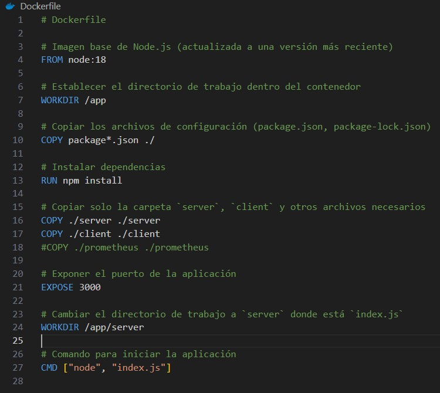
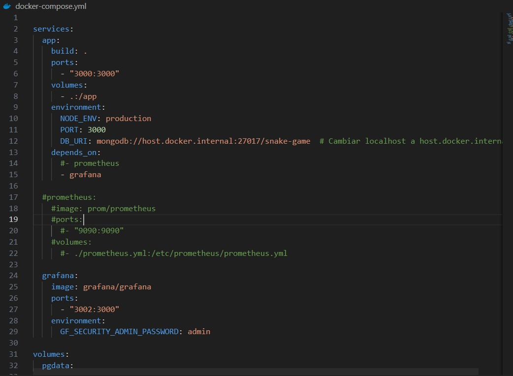
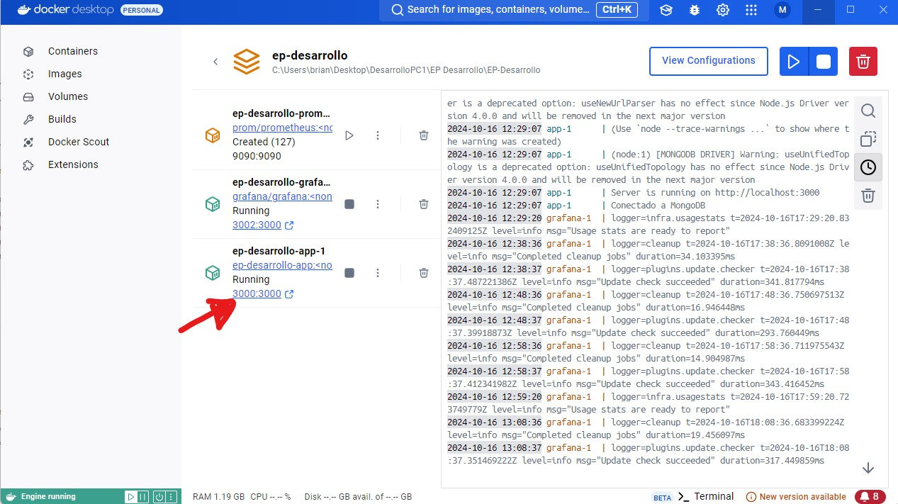
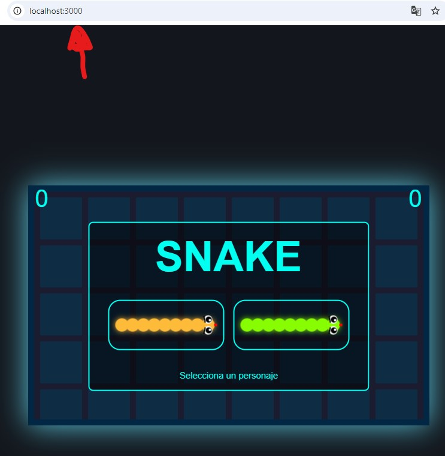

### Implementación 1er power up (Poción: eliminación de 1 cuerpo)  
Creamos una class potion con la lógica del power up:


```javascript
// Mueve la variable potionVisible fuera de la clase Potion
let potionVisible = false;  // Ahora es una variable global

class Potion {
    constructor(position, radio, color, context) {
        this.position = position;
        this.radio = radio;
        this.color = color;
        this.context = context;
    }
    
    draw() {
        this.context.save();
        this.context.beginPath();
        this.context.arc(this.position.x, this.position.y, this.radio, 0, 2 * Math.PI);
        this.context.fillStyle = this.color;
        this.context.shadowColor = this.color;
        this.context.shadowBlur = 10;
        this.context.fill();
        this.context.closePath();
        this.context.restore();
    }

    collision(snake) {
        let v1 = {
            x: this.position.x - snake.position.x,
            y: this.position.y - snake.position.y
        };
        let distance = Math.sqrt(
            (v1.x * v1.x) + (v1.y * v1.y)
        );

        if (distance < snake.radio + this.radio) {
            // Reducir el tamaño de la serpiente
            if (snake.body.length > 0) {
                snake.body.pop(); // Elimina el último segmento de la serpiente
            }
            
            // Ocultar la poción hasta que se coman otras 5 manzanas
            potionVisible = false;
            
            // Cambiar posición de la poción
            this.position = {
                x: Math.floor(Math.random() * ((canvas.width - this.radio) - this.radio + 1)) + this.radio,
                y: Math.floor(Math.random() * ((canvas.height - this.radio) - this.radio + 1)) + this.radio,
            };
        }
    }
}
```

luego esto hará un cambio en update():

```javascript
function update() {
    background();
    if (play) {
        snake.update();
        apple.draw();
        apple.collision(snake);

        // Actualiza el tiempo
        const elapsedTime = Math.floor((Date.now() - startTime) / 1000); // Tiempo en segundos
        document.querySelector(".time").textContent = elapsedTime; // Actualiza el tiempo en la pantalla

        // Dibujar y comprobar colisión de la poción solo si es visible
        if (potionVisible) {
            potion.draw();
            potion.collision(snake);
        }
        
    }
    requestAnimationFrame(update);
}
update();
```


## Sprint 3:

| **ID** | **Historia de Usuario / Tarea**                                                                    | **Prioridad** | **Puntos de Historia** | **Sprint**   | **Enlace**                                             |
|--------|----------------------------------------------------------------------------------------------------|---------------|------------------------|--------------|-------------------------------------------------------|
| 5      | Implementar la monitorización con prometheus y grafana                                             | P1            | 5                      | Sprint 3     | [Ver Tarea](https://github.com/McBikan/EP-Desarrollo/issues/5) |
| 6      | Implementar la BD para guardar los registros de juego                                               | P1            | 4                      | Sprint 3     | [Ver Tarea](https://github.com/McBikan/EP-Desarrollo/issues/6) |
| 7      | Implementar el juego multijugador (2 players)                                                      | P0            | 5                      | Sprint 3     | [Ver Tarea](https://github.com/McBikan/EP-Desarrollo/issues/7) |
| 8      | Crear un ranking de los mejores puntajes                                                            | P2            | 5                      | Sprint 3     | [Ver Tarea](https://github.com/McBikan/EP-Desarrollo/issues/9) |
| 10     | Implementación de las pruebas BDD con cucumber                                                      | P1            | 3                      | Sprint 3     | [Ver Tarea](https://github.com/McBikan/EP-Desarrollo/issues/11) |

### Implementación de las Pruebas BDD(Behavior-Driven Development)(Desarrollo Guiado por Comportamiento) con cucumber:
Hemos aplicado cucumber para hacer las pruebas de comportamiento


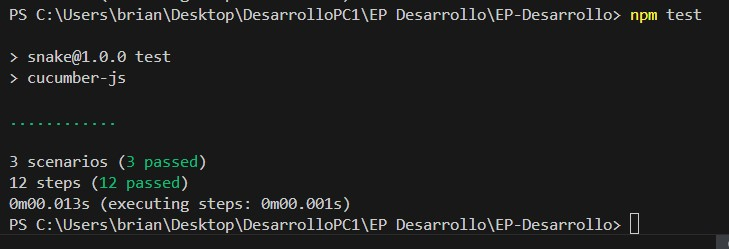
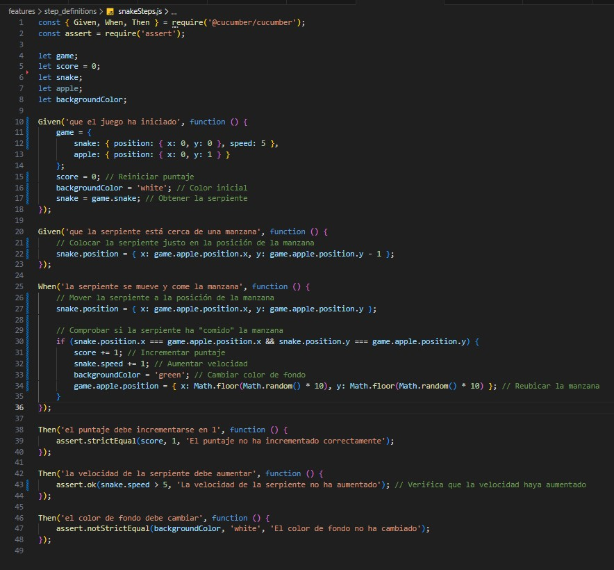
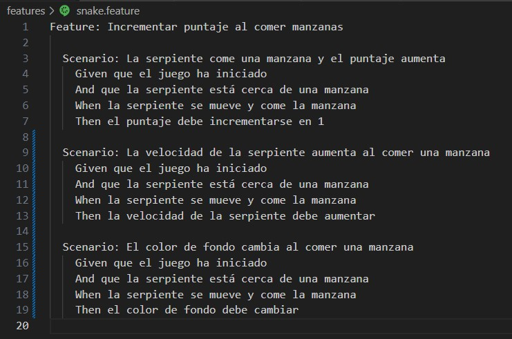

Implementamos 3 escenarios y 12 pasos


## Conclusiones:
El juego al final se verá así:
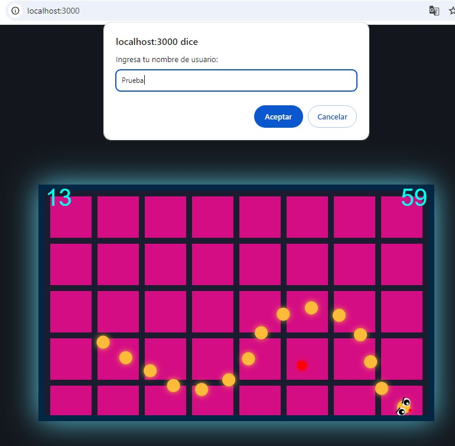

Hemos desarrollado charts para comprender el desarrollo del juego:
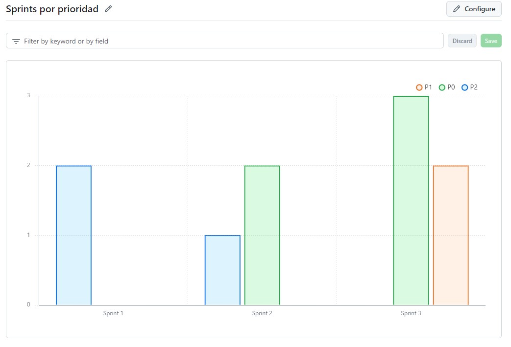
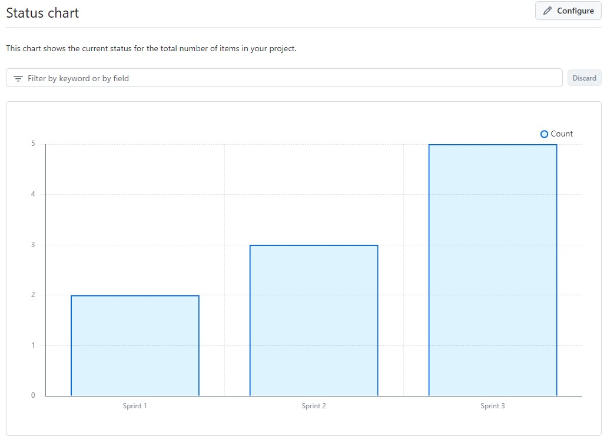
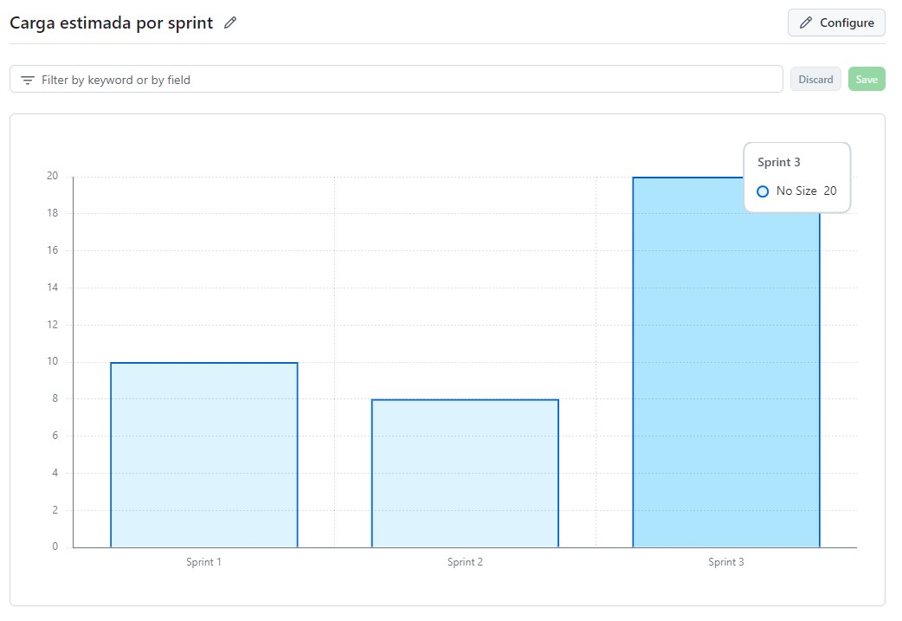


