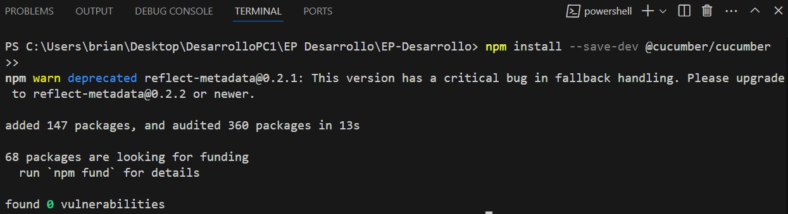
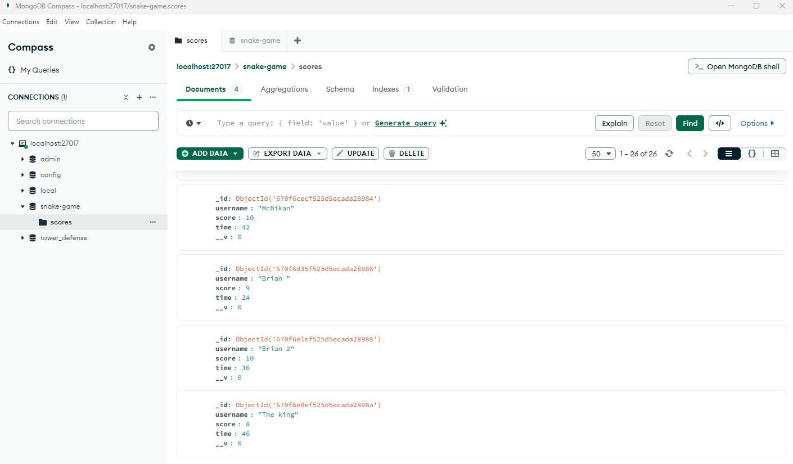

# Reclamo exámen Parcial:
En las observaciones de mi práctica se menciona que no cuento con tablero Kanban pero mi proyecto si cuenta con tablero Kanban en el siguiente enlace: https://github.com/users/McBikan/projects/3
En el tablero Kanban también se puede observar el análisis y resultados de los burnchars, solo habrán 2 porque la versión free del github así lo permite, igual pude tomarle captura a varias tablas del burnchars.
En la documentación no pude ser más minucioso debido a que soy solo 1 integrante y me falto algo de tiempo para culminarlo, pero en lo que respecto de funcionalidad esta todo perfecto , pues el juego cuenta con varias pautas que usted coloco en el documento como las pruebas de comportamiento (BDD) , también los power ups que solicitaba el juego también está , siendo solo 1 power up (class Poison) que disminuye el cuerpo del snake en 1, yo la verdad siento que no se ha ejecutado mi proyecto y no se ha visto las funcionalidades del mismo, porque no creo que corresponda la nota a la cantidad de horas que me ha tomado siendo solo 1 alumno, y a todas las funciones con las que cuenta como: base de datos donde guardar los puntajes de cada jugador(mongodb) , BDD con cucumber para js, power up (Poison), docker, grafana y prometheus (que si se levantan desde el docker-compose, pero no les dí parametros para hacer la medición, falto tiempo , era opcional), entre otras, me gustaría poder explayarme un poco más respecto al proyecto pues siento que mi único error fue no poder completar toda la documentación en el tiempo que se me dió pues era mucho trabajo para hacer siendo solo 1 alumno para un proyecto tan grande, todo mi proyecto solo se trabajo hasta el miércoles de la entrega a la 1pm, pues no quise modificar nada posterior a ello pues fue como se nos indico. Espero se pueda tomar de la mejor manera mis observaciones, pues siento la nota es muy injusta y no siento que corresponda para el proyecto que presenté.

# EP DESARROLLO

## Introducción:

| **ID** | **Historia de Usuario / Tarea**                                                                    | **Prioridad** | **Puntos de Historia** | **Sprint**   | **Enlace**                                             |
|--------|----------------------------------------------------------------------------------------------------|---------------|------------------------|--------------|-------------------------------------------------------|
| 1      | Creación de la interfaz del juego                                                                  | P0            | 3                      | Sprint 1     | [Ver Tarea](https://github.com/McBikan/EP-Desarrollo/issues/1) |
| 2      | Implementación de la lógica de juego                                                                | P0            | 3                      | Sprint 1     | [Ver Tarea](https://github.com/McBikan/EP-Desarrollo/issues/2) |
| 3      | Creación de un segundo snake                                                                         | P0            | 7                      | Sprint 2     | [Ver Tarea](https://github.com/McBikan/EP-Desarrollo/issues/3) |
| 4      | Implementación del despliegue de docker containers para la app de juego                             | P0            | 2                      | Sprint 2     | [Ver Tarea](https://github.com/McBikan/EP-Desarrollo/issues/4) |
| 5      | Implementar la monitorización con prometheus y grafana                                             | P1            | 5                      | Sprint 3     | [Ver Tarea](https://github.com/McBikan/EP-Desarrollo/issues/5) |
| 6      | Implementar la BD para guardar los registros de juego                                               | P1            | 4                      | Sprint 3     | [Ver Tarea](https://github.com/McBikan/EP-Desarrollo/issues/6) |
| 7      | Implementar el juego multijugador (2 players)                                                      | P0            | 5                      | Sprint 3     | [Ver Tarea](https://github.com/McBikan/EP-Desarrollo/issues/7) |
| 8      | Crear un ranking de los mejores puntajes                                                            | P2            | 5                      | Sprint 3     | [Ver Tarea](https://github.com/McBikan/EP-Desarrollo/issues/9) |
| 9      | Implementación 1er power up (Poción: eliminación de 1 cuerpo)                                       | P2            | 3                      | Sprint 2     | [Ver Tarea](https://github.com/McBikan/EP-Desarrollo/issues/10) |
| 10     | Implementación de las pruebas BDD con cucumber                                                      | P1            | 3                      | Sprint 3     | [Ver Tarea](https://github.com/McBikan/EP-Desarrollo/issues/11) |


## Sprint 1:

| **ID** | **Historia de Usuario / Tarea**                                                                    | **Prioridad** | **Puntos de Historia** | **Sprint**   | **Enlace**                                             |
|--------|----------------------------------------------------------------------------------------------------|---------------|------------------------|--------------|-------------------------------------------------------|
| 1      | Creación de la interfaz del juego                                                                  | P0            | 3                      | Sprint 1     | [Ver Tarea](https://github.com/McBikan/EP-Desarrollo/issues/1) |
| 2      | Implementación de la lógica de juego                                                                | P0            | 3                      | Sprint 1     | [Ver Tarea](https://github.com/McBikan/EP-Desarrollo/issues/2) |


### Intefaz del juego:
Contamos con el archivo index.html el cuál crea contenedores donde ocurrirá el juego, se mostrará el puntaje, tiempo y menú:
```html
<body>
    <div class="container">
        <canvas id="canvas"></canvas>
        <span class="score">0</span>
        <span class="time">0</span>
        <div class="menu">
            <h2>SNAKE</h2>
            <div class="characters">
                <canvas id="snake-1"></canvas>
                <canvas id="snake-2"></canvas>
            </div>
            <p>Selecciona un personaje</p>
        </div>
    </div>
</body>
```
en el style.css le damos una mejora a la interfaz a nivel visual.

### Implementación de la lógica de juego:
Tenemos 3 class y 2 funciones para aplicar la lógica del juego:
- class Apple
- class SnakeBody
- class Snake
- function init
- function update


## Sprint 2:

| **ID** | **Historia de Usuario / Tarea**                                                                    | **Prioridad** | **Puntos de Historia** | **Sprint**   | **Enlace**                                             |
|--------|----------------------------------------------------------------------------------------------------|---------------|------------------------|--------------|-------------------------------------------------------|
| 3      | Creación de un segundo snake                                                                         | P0            | 7                      | Sprint 2     | [Ver Tarea](https://github.com/McBikan/EP-Desarrollo/issues/3) |
| 4      | Implementación del despliegue de docker containers para la app de juego                             | P0            | 2                      | Sprint 2     | [Ver Tarea](https://github.com/McBikan/EP-Desarrollo/issues/4) |
| 9      | Implementación 1er power up (Poción: eliminación de 1 cuerpo)                                       | P2            | 3                      | Sprint 2     | [Ver Tarea](https://github.com/McBikan/EP-Desarrollo/issues/10) |

### Implementación del despliegue de docker containers para la app de juego:


### Implementación 1er power up (Poción: eliminación de 1 cuerpo)  
Creamos una class potion con la lógica del power up:


```javascript
// Mueve la variable potionVisible fuera de la clase Potion
let potionVisible = false;  // Ahora es una variable global

class Potion {
    constructor(position, radio, color, context) {
        this.position = position;
        this.radio = radio;
        this.color = color;
        this.context = context;
    }
    
    draw() {
        this.context.save();
        this.context.beginPath();
        this.context.arc(this.position.x, this.position.y, this.radio, 0, 2 * Math.PI);
        this.context.fillStyle = this.color;
        this.context.shadowColor = this.color;
        this.context.shadowBlur = 10;
        this.context.fill();
        this.context.closePath();
        this.context.restore();
    }

    collision(snake) {
        let v1 = {
            x: this.position.x - snake.position.x,
            y: this.position.y - snake.position.y
        };
        let distance = Math.sqrt(
            (v1.x * v1.x) + (v1.y * v1.y)
        );

        if (distance < snake.radio + this.radio) {
            // Reducir el tamaño de la serpiente
            if (snake.body.length > 0) {
                snake.body.pop(); // Elimina el último segmento de la serpiente
            }
            
            // Ocultar la poción hasta que se coman otras 5 manzanas
            potionVisible = false;
            
            // Cambiar posición de la poción
            this.position = {
                x: Math.floor(Math.random() * ((canvas.width - this.radio) - this.radio + 1)) + this.radio,
                y: Math.floor(Math.random() * ((canvas.height - this.radio) - this.radio + 1)) + this.radio,
            };
        }
    }
}
```

luego esto hará un cambio en update():

```javascript
function update() {
    background();
    if (play) {
        snake.update();
        apple.draw();
        apple.collision(snake);

        // Actualiza el tiempo
        const elapsedTime = Math.floor((Date.now() - startTime) / 1000); // Tiempo en segundos
        document.querySelector(".time").textContent = elapsedTime; // Actualiza el tiempo en la pantalla

        // Dibujar y comprobar colisión de la poción solo si es visible
        if (potionVisible) {
            potion.draw();
            potion.collision(snake);
        }
        
    }
    requestAnimationFrame(update);
}
update();
```


## Sprint 3:

| **ID** | **Historia de Usuario / Tarea**                                                                    | **Prioridad** | **Puntos de Historia** | **Sprint**   | **Enlace**                                             |
|--------|----------------------------------------------------------------------------------------------------|---------------|------------------------|--------------|-------------------------------------------------------|
| 5      | Implementar la monitorización con prometheus y grafana                                             | P1            | 5                      | Sprint 3     | [Ver Tarea](https://github.com/McBikan/EP-Desarrollo/issues/5) |
| 6      | Implementar la BD para guardar los registros de juego                                               | P1            | 4                      | Sprint 3     | [Ver Tarea](https://github.com/McBikan/EP-Desarrollo/issues/6) |
| 7      | Implementar el juego multijugador (2 players)                                                      | P0            | 5                      | Sprint 3     | [Ver Tarea](https://github.com/McBikan/EP-Desarrollo/issues/7) |
| 8      | Crear un ranking de los mejores puntajes                                                            | P2            | 5                      | Sprint 3     | [Ver Tarea](https://github.com/McBikan/EP-Desarrollo/issues/9) |
| 10     | Implementación de las pruebas BDD con cucumber                                                      | P1            | 3                      | Sprint 3     | [Ver Tarea](https://github.com/McBikan/EP-Desarrollo/issues/11) |

### Implementación de las Pruebas BDD(Behavior-Driven Development)(Desarrollo Guiado por Comportamiento) con cucumber:
Hemos aplicado cucumber para hacer las pruebas de comportamiento




Implementamos 3 escenarios y 12 pasos.

### Implementación de la BD para guardar los registros del juego:



## Conclusiones:
El juego al final se verá así:


Hemos desarrollado charts para comprender el desarrollo del juego.


